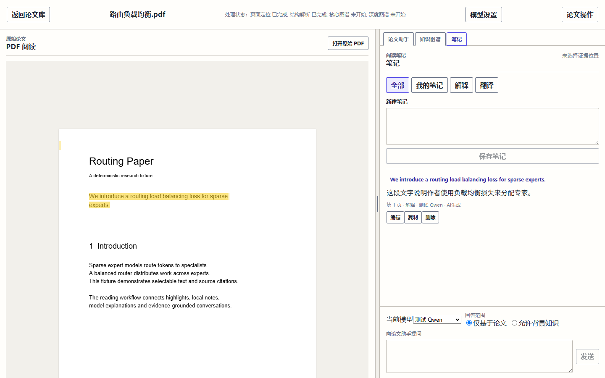
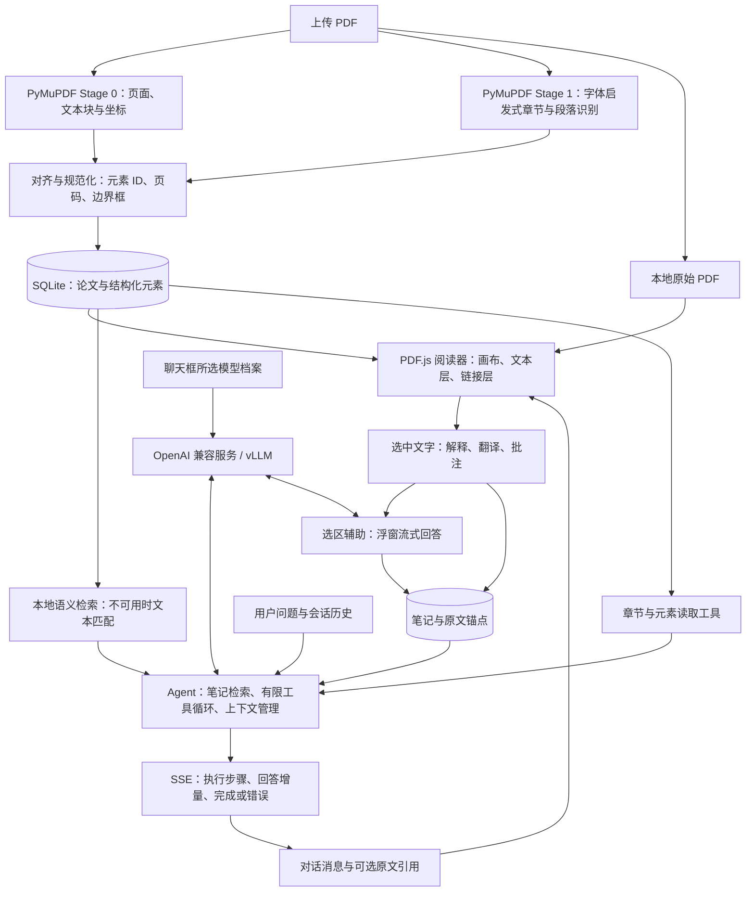

# paper-agent · 论文阅读助手

把 **PDF 阅读、划词解释、中文翻译、笔记和模型对话** 放在同一个工作区。围绕当前论文提问，助手按需检索正文、读取章节和笔记，并将可定位的引用连接回原文。

面向中文用户，采用本地优先、单用户架构：论文和阅读记录保存在本机，推理接入你配置的 OpenAI 兼容模型服务（包括 vLLM）。无需额外部署 Model Gateway 或独立向量数据库。

> 本地优先不等于完全离线：使用远程模型时，请求中的论文片段、笔记和对话会发送到所选服务。模型回答不经过证据充分性校验，请结合原文判断。

[功能概览](#功能概览) · [技术路线图](#技术路线图) · [快速开始](#快速开始) · [模型配置](#模型配置) · [开发路线图](#开发路线图) · [开发者入口](#开发者入口)

## 功能概览

| 场景 | 当前能力 |
| --- | --- |
| 阅读论文 | 上传 PDF、章节导航、缩放与文本选择；PDF 自带链接支持内部跳转、外部访问、悬停预览和跳转后返回。 |
| 划词辅助 | 选中文字后解释、翻译、高亮、记笔记或向助手提问；解释和翻译在可拖动的轻量浮窗中逐步输出。 |
| 笔记记忆 | 解释和翻译成功后自动保存为带原文锚点的笔记；对话时自动检索当前论文的相关笔记，并非每轮发送全部笔记。 |
| 连续对话 | 消息按对话顺序展示；准备阶段显示笔记读取、工具执行等进度，最终回答逐步流式输出。 |
| 原文检索 | 本地多语言嵌入支持语义检索；助手可按需读取章节和元素。语义检索不可用时退回文本匹配。 |
| 多模型切换 | 保存多个模型档案，在聊天框切换而不新建会话；解释、翻译使用聊天框当前选中的模型。 |
| 上下文管理 | 显示请求上下文的估算占用；配置上下文长度后启用历史压缩，摘要失败时降级截断。 |
| 数据管理 | 删除论文时清理原始 PDF 和所属数据库记录；模型档案独立保留。检索缓存的清理边界见下文。 |

### 阅读工作区示意



截图使用合成测试论文和固定模型回答，展示工作区布局；最新交互以实际运行界面为准。

典型用法：**上传论文 → 选择模型 → 阅读与划词 → 保存笔记 → 连续追问 → 点击引用回到原文**。

## 技术路线图

下面是当前代码的数据与调用路径，不是待实现的产品蓝图。



### 核心实现选择

| 层次 | 技术与职责 |
| --- | --- |
| 前端 | React、TypeScript、Vite；PDF.js 负责 PDF 渲染、文本选择和链接定位。 |
| API | FastAPI、Pydantic；HTTP 管理资源，SSE 传递流式回答与执行进度。 |
| 解析 | PyMuPDF 同源提取版面几何与文本结构，再对齐为可定位的文档元素。 |
| 存储 | SQLAlchemy + SQLite 保存业务数据；原始文件、密钥和检索缓存分目录保存。 |
| 检索 | 使用 paperqa2（安装包为 `paper-qa[local]`）的本地嵌入能力，对文档元素做余弦相似度检索；并非将整套问答交给 paperqa2。 |
| Agent | 项目自有运行时管理工具调用、笔记上下文、历史压缩、幂等与消息持久化；单次问答累计最多执行 6 次工具调用。 |
| 模型适配 | OpenAI Python 客户端接入兼容服务；请求绑定模型档案，历史消息保留不含密钥的模型快照。 |
| 验证 | pytest、Vitest、Playwright；以合成 PDF 和模拟模型进行确定性测试。 |

**与早期设计的区别：** 当前解析不再使用 MarkItDown；知识图谱功能及其可视化已移除；回答不再经过 Citation Guard 的证据门禁。历史命名 `citation_guard` 目前用于回答解析与可选引用处理，不代表系统会核验回答真实性。

## 快速开始

### 环境要求

- Python **3.12 或更高版本**。
- Node.js **22.14+ 的 22.x 版本，或 24+**，以及 npm。
- 需要模型辅助时，准备可访问的 OpenAI 兼容服务；论文助手需要工具调用能力。
- 首次安装依赖和下载嵌入模型需要网络及足够磁盘空间。Windows 建议使用较短的项目路径，减少依赖安装遇到路径长度限制的风险。

以下命令从仓库根目录执行。这是本机开发和试用方式，不是公网部署方案。

### Windows / PowerShell

安装依赖：

```powershell
py -3.12 -m venv .venv
.\.venv\Scripts\python.exe -m pip install -e ".[dev]"
cd web
npm ci
cd ..
```

终端一启动后端：

```powershell
.\.venv\Scripts\python.exe -m uvicorn paper_agent.app:create_app --factory --host 127.0.0.1 --port 8000 --reload
```

终端二启动前端：

```powershell
cd web
npm run dev -- --host 127.0.0.1 --port 5173 --strictPort
```

### Linux / macOS

安装依赖：

```bash
python3.12 -m venv .venv
.venv/bin/python -m pip install -e ".[dev]"
cd web
npm ci
cd ..
```

终端一启动后端：

```bash
.venv/bin/python -m uvicorn paper_agent.app:create_app --factory --host 127.0.0.1 --port 8000 --reload
```

终端二启动前端：

```bash
cd web
npm run dev -- --host 127.0.0.1 --port 5173 --strictPort
```

打开 [阅读工作区](http://127.0.0.1:5173/)。通过 [健康检查](http://127.0.0.1:8000/health) 确认后端响应，通过 [API 文档](http://127.0.0.1:8000/docs) 查看实际接口。前端开发服务将 `/api` 代理到后端的 8000 端口。

### 第一次使用

1. 在模型设置中新增档案，填写服务信息并测试能力。
2. 上传一篇带可提取文本的 PDF，等待解析完成。
3. 在聊天框选择模型，询问“这篇论文主要解决什么问题？”或“总结方法与局限”。
4. 在 PDF 中选中文字，使用解释、翻译或笔记；完成后在笔记页查看保存结果。
5. 继续追问，观察执行进度与逐步输出；有原文引用时点击定位核对。

## 模型配置

优先使用界面中的模型设置。可配置多个服务地址，也可在同一服务下配置不同模型。

| 配置项 | 说明 |
| --- | --- |
| 展示名称 | 用于聊天框区分模型，不必与服务端名称相同。 |
| 服务地址 | API 根地址，例如 `http://127.0.0.1:8001/v1`，不要填写完整的 `/chat/completions` 地址。 |
| 模型名称 | 必须与服务端实际提供的模型标识一致。 |
| API Key | 按服务要求填写；未开启鉴权的本地 vLLM 可省略或使用 `EMPTY`。 |
| 上下文长度 | 可选；填写后启用 Agent 的预算与压缩。留空表示应用不主动管理上限，不代表模型真的无限长。 |
| 最大输出 token | 可选；填写后传给模型服务。两项都填写时，输出上限必须小于上下文长度。 |

解释和翻译需要**基础对话能力**，论文助手需要**工具调用能力**。结构化输出检测仅作能力展示，不是聊天前置条件。修改地址、模型名称或密钥后，需要重新测试；vLLM 的工具解析器与聊天模板也必须匹配模型。

切换模型保留当前会话；新请求使用聊天框选中的档案，不会静默改用默认模型。上下文占用是启发式估算，不是精确计费数据；压缩只影响请求组装，不改写已保存的聊天记录。

也支持用环境变量提供只读模型档案，在启动后端的终端中设置：

```text
PAPER_AGENT_REASONING_BASE_URL=http://127.0.0.1:8001/v1
PAPER_AGENT_REASONING_MODEL=your-served-model
PAPER_AGENT_REASONING_API_KEY=EMPTY
```

地址与模型名称必须同时设置。另支持 `PAPER_AGENT_REASONING_CONTEXT_LENGTH` 和 `PAPER_AGENT_REASONING_MAX_OUTPUT_TOKENS`。具体检测、错误与档案生命周期见[模型服务文档](docs/model-services.md)。

### 本地语义检索

默认嵌入模型为 `st-paraphrase-multilingual-MiniLM-L12-v2`，支持中文问题检索英文等多语言论文内容。可在后端启动前通过 `PAPER_AGENT_EMBEDDING_MODEL` 改为兼容的嵌入模型标识；它独立于聊天框中的推理模型。

- 第一次检索可能需要下载模型权重并建立索引，因此比后续查询慢。
- 索引持久化到本地；元素内容变化时按需重建，不需要手工安排上传后的索引任务。
- 嵌入模型加载或运行失败时退回文本匹配，跨语言检索效果会下降。
- `paper-qa[local]` 会带入本地推理依赖；运行时降级不能替代安装阶段缺失的依赖。

## 数据、安全与删除

默认数据目录为**后端启动时工作目录**下的 `.paper-agent/`。请固定从仓库根目录启动，避免误以为已有论文丢失。

```text
.paper-agent/
├── paper-agent.db       # 论文、元素、批注、笔记、会话及模型档案
├── papers/              # 原始 PDF
├── search-indexes/      # 检索向量及索引元数据
├── secrets/             # 模型密钥，与档案分开存储
└── .trash/              # 删除暂存与恢复标记，不是用户回收站
```

- 删除是永久操作，会删除原始 PDF 及所属数据库记录，包括笔记、批注和会话；不会删除独立的模型档案。进行中的论文操作可能暂时阻止删除。
- 文件暂存、数据库事务和启动恢复降低中断造成的不一致风险。**当前删除流程尚未联动清理 `search-indexes/` 的派生缓存，不能将删除论文等同于所有派生数据已彻底擦除。**
- 备份前停止后端，再备份整个数据目录；其中包含私有内容与凭据，应按敏感数据保护。
- 密钥单独存储不等于加密存储。不要提交运行目录、真实 PDF、密钥或带私人数据的截图。
- 当前没有多用户鉴权和租户隔离。不要直接暴露到公网，也不要用多 worker 部署绕过单进程并发边界。

## 开发路线图

已完成能力与建议后续方向分开列出。**后续阶段不是已实现功能，也不承诺发布时间。**

| 阶段 | 状态 | 技术目标与验收方向 |
| --- | --- | --- |
| 阅读基础 | 已实现 | PDF 解析与定位、阅读器、批注、笔记、多模型档案、论文与数据库记录删除。 |
| 对话体验 | 已实现 | 笔记上下文、选区辅助自动入笔记、Markdown 流式回答、执行步骤展示、可选引用定位。 |
| 检索与长对话 | 已实现 | 本地多语言语义检索、索引持久化、上下文估算与压缩、PDF 链接预览和返回。 |
| 稳定性与数据闭环 | 建议下一阶段 | 补齐删除后的检索缓存清理；完善首次索引、模型连接和流式中断的状态提示与回归验证。 |
| 阅读覆盖面 | 后续方向 | OCR 支持扫描论文；跨页选区采用多片段锚点，同步设计迁移、定位和交互测试。 |
| 协作与同步 | 长期方向 | 先建立身份认证、工作区所有权与并发边界，再设计多端同步、冲突处理及一致删除；密钥不随普通内容同步。 |

OCR、跨页选区、多用户和云同步的设计前提见[后续路线图](docs/roadmap.md)。历史知识图谱设计仅供追溯，不代表当前仍提供该功能或已计划恢复。

## 常见问题与当前限制

| 问题 | 检查方向 |
| --- | --- |
| 配置模型后不能聊天 | 检查地址、模型标识、密钥和工具调用能力；修改配置后重新测试。仅通过基础对话检测不足以运行论文助手。 |
| 第一次检索等待较久 | 查看后端日志中的模型下载和索引状态，确认权重可获取。退回文本匹配后，中文问题可能匹配不到英文原文。 |
| PDF 无法选中文字 | 扫描件可能没有文本层，当前不提供 OCR；复杂排版也可能影响章节识别与文本顺序。 |
| 回答没有引用 | 引用是可选输出，不是强制门禁；系统不再因为缺少证据而替换回答。请主动核对关键结论。 |
| 长对话仍超出模型长度 | 检查上下文配置是否符合服务实际上限；估算与服务端 tokenizer 有差异，压缩不保证任何输入都可容纳。 |
| 换目录启动后列表为空 | 默认数据目录跟随后端工作目录，检查是否启动到了另一份 `.paper-agent/`。 |

当前重点是单篇论文的本地阅读闭环：不支持跨页文本选区、多用户协作或云同步。工具执行进度不是模型内部思维过程，回答内容也不构成事实正确性的保证。

## 开发者入口

```text
src/paper_agent/
├── app.py              # 应用装配与服务注入
├── config.py           # 数据路径与环境变量
├── parsers/            # 两阶段 PDF 解析与对齐
├── routes/             # HTTP / SSE 接口
├── services/           # Agent、检索、上下文、批注、模型与删除
├── models/             # 模型协议适配
└── migrations.py       # 数据库迁移
web/src/                # 工作区、组件、接口与客户端状态
tests/                  # 后端单元、集成与 E2E 测试服务
web/e2e/                # 浏览器验收
docs/                   # 架构、契约、交接与历史设计
```

建议先阅读[文档导航](docs/README.md)、[贡献指南](CONTRIBUTING.md)和[开发交接](docs/developer-handoff.md)，再按改动范围查阅：

- [系统架构](docs/architecture.md) · [API 业务语义](docs/api.md) · [数据模型](docs/data-model.md)
- [PDF 批注](docs/pdf-annotations.md) · [笔记记忆](docs/note-memory.md) · [模型服务](docs/model-services.md)
- [本地开发](docs/development.md) · [测试策略](docs/testing.md) · [上下文压缩决策](docs/adr/0004-context-compaction.md)

历史规格和交接记录有各自的时间范围，继续开发前应核对当前实现与测试，不要把旧验收结果当作本次改动已通过的证明。`sources/` 为同步的只读参考材料，不应修改。

### 验证命令

后端测试，从仓库根目录执行：

```powershell
# Windows
.\.venv\Scripts\python.exe -m pytest
```

```bash
# Linux / macOS
.venv/bin/python -m pytest
```

前端测试与构建：

```bash
cd web
npm test
npm run build
```

浏览器验收，从 `web/` 执行：

```bash
npx playwright install chromium
npm run test:e2e
```

E2E 自动启动独立测试后端与前端，使用合成 PDF 和模拟模型，不调用真实模型。执行前确保 8000、5173 端口空闲；不要为腾出端口而直接终止未知进程。完整的流式、真实模型和发布验证流程见[测试策略](docs/testing.md)。
