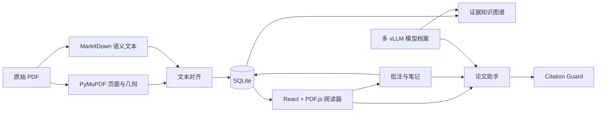

# paper-agent

## 项目简介

paper-agent 是一个本地优先的论文阅读与研究工作台。它把原始 PDF、可定位文本、批注、笔记、知识图谱和带引用校验的论文助手放在同一个界面中，模型服务统一使用 OpenAI-compatible vLLM。

项目默认单机运行：论文、SQLite 数据库和模型密钥都保存在本地，不依赖 Model Gateway 或云端文档服务。

## 功能概览

- 连续浏览 PDF 原始页面，并通过 PDF.js TextLayer 选择可复制文字。
- 对单页选区执行高亮、解释、翻译、手写笔记或“问助手”。
- 解释和翻译使用聊天框当前模型，完成后自动保存为带原文锚点的笔记。
- 论文助手自动检索当前论文的相关笔记，并对论文结论执行 Citation Guard 引用校验。
- 构建核心和深度知识图谱，图谱节点和聊天引用都可跳回原始证据位置。
- 配置多个 vLLM 模型档案，在聊天框中切换；切换模型不会清空当前会话。
- 永久删除 PDF 及其页面、解析结果、图谱、批注、笔记和会话数据。
- 桌面端使用 PDF + 工具区双栏布局，小屏使用“论文 / 工具”切换。

## 界面截图

最终截图将在确定性端到端数据完成验收后更新。项目不会把私人论文或本地数据库作为 README 示例资产提交。

## 技术架构



主要技术栈：Python 3.12、FastAPI、SQLAlchemy、SQLite、PyMuPDF、MarkItDown、React、TypeScript、Vite、PDF.js、React Flow、ELK、Vitest 和 pytest。

## 环境要求

- Python 3.12 或更高版本。
- Node.js 22.14+（Node 22 系列）或 Node.js 24+。
- npm。
- 可选：一个或多个 OpenAI-compatible vLLM 服务。阅读、笔记和 PDF 管理不要求模型服务；解释、翻译、图谱构建和论文助手需要相应模型能力。

## 快速开始（Windows PowerShell）

在仓库根目录安装后端：

```powershell
py -3.12 -m venv .venv
.\.venv\Scripts\python.exe -m pip install -e ".[dev]"
```

安装前端：

```powershell
Set-Location web
npm ci
Set-Location ..
```

终端一，启动后端：

```powershell
.\.venv\Scripts\python.exe -m uvicorn paper_agent.app:create_app --factory --host 127.0.0.1 --port 8000 --reload
```

终端二，启动前端：

```powershell
Set-Location web
npm run dev
```

浏览器打开 `http://127.0.0.1:5173`。后端健康检查地址是 `http://127.0.0.1:8000/health`。

## 快速开始（Linux/macOS）

在仓库根目录安装依赖：

```bash
python3.12 -m venv .venv
.venv/bin/python -m pip install -e ".[dev]"
cd web
npm ci
cd ..
```

终端一，启动后端：

```bash
.venv/bin/python -m uvicorn paper_agent.app:create_app --factory --host 127.0.0.1 --port 8000 --reload
```

终端二，启动前端：

```bash
cd web
npm run dev
```

## 配置多个 vLLM 模型

1. 启动一个或多个 OpenAI-compatible vLLM 服务。
2. 在阅读工作台点击“模型设置”，新增模型档案。
3. 填写配置名称、服务地址、模型名称和可选 API 密钥；按需设为默认档案并执行能力测试。
4. 在聊天框的“当前模型”中选择档案。聊天、解释、翻译和知识图谱构建都会使用这里当前选中的模型。

模型档案按请求解析为不可变快照。会话中切换模型只影响后续请求，不会修改历史消息，也不会重置 `conversation_id`。密钥与 SQLite 中的公开档案字段分离保存，API 响应和模型快照不会返回密钥。

以下环境变量只提供单模型兼容档案，适合本地快速联调；在界面中创建的模型档案是正式的多模型配置入口：

```text
PAPER_AGENT_REASONING_BASE_URL=http://127.0.0.1:8001/v1
PAPER_AGENT_REASONING_MODEL=your-served-model
PAPER_AGENT_REASONING_API_KEY=EMPTY
```

`PAPER_AGENT_REASONING_BASE_URL` 与 `PAPER_AGENT_REASONING_MODEL` 必须同时设置或同时省略。工具调用模型还需要与模型匹配的 vLLM chat template、`--enable-auto-tool-choice` 和 tool-call parser。

## 数据目录与永久删除

默认数据目录是仓库启动目录下的 `.paper-agent/`：

- `.paper-agent/paper-agent.db`：SQLite 数据库。
- `.paper-agent/papers/`：按系统生成 ID 保存的原始 PDF。
- `.paper-agent/secrets/`：模型密钥文件。
- `.paper-agent/.trash/`：删除事务的短暂恢复区。

“永久删除论文”会删除原始 PDF，以及该论文拥有的页面、解析元素、处理记录、图谱、文本锚点、高亮、笔记和会话数据。全局模型档案不会随论文删除。删除流程先暂存源文件，再在单个数据库事务中逆序删除；如果进程中断，下一次启动会依据恢复标记完成清理或还原。

删除不可作为普通回收站撤销。重要论文请先自行备份原始 PDF 和需要保留的笔记。

## 测试

后端完整测试：

```powershell
.\.venv\Scripts\python.exe -m pytest -v
```

前端单元测试与生产构建：

```powershell
Set-Location web
npm test
npm run build
```

确定性浏览器端到端测试及对应的 npm 脚本将在后续发布验收任务中添加；测试不会依赖公网、真实 vLLM 或私人 PDF。

## 开发者文档索引

- [文档导航](docs/README.md)
- [贡献与开发指南](CONTRIBUTING.md)
- [当前开发交接](docs/developer-handoff.md)
- [系统架构](docs/architecture.md)
- [HTTP API](docs/api.md)
- [数据模型](docs/data-model.md)
- [PDF 选区与批注](docs/pdf-annotations.md)
- [模型服务与多模型档案](docs/model-services.md)
- [笔记记忆](docs/note-memory.md)
- [本地开发](docs/development.md)
- [测试策略](docs/testing.md)
- [路线图](docs/roadmap.md)

## 当前限制

- 不支持扫描件 OCR；没有可复制文字层的页面仍可查看，但不能创建文字选区。
- 不支持跨页文字选区；一个锚点只属于一页。
- 当前是本地单用户产品，不支持账户、多租户或细粒度权限。
- 不提供云同步、多人协作或跨设备自动同步。
- 知识图谱当前不可在画布上直接编辑。
- 运行时锁和模型使用租约是进程内机制，不承诺多 worker / 多进程并发。

## 安全说明

- 默认只监听 `127.0.0.1`；如需暴露到局域网或公网，请先增加认证、TLS 和访问控制。
- 不要把真实 API 密钥写入 README、`.env.example`、命令历史、日志、SQLite 或 Git。
- 不要提交 `.paper-agent/`、PDF、数据库、模型密钥、`.env`、浏览器测试报告或私人论文截图。
- 论文助手只把通过 Citation Guard 校验的论文结论作为正式答案；背景知识与论文证据分开显示。
- `sources/` 是同步参考资料，只读，不应修改、移动或删除。
