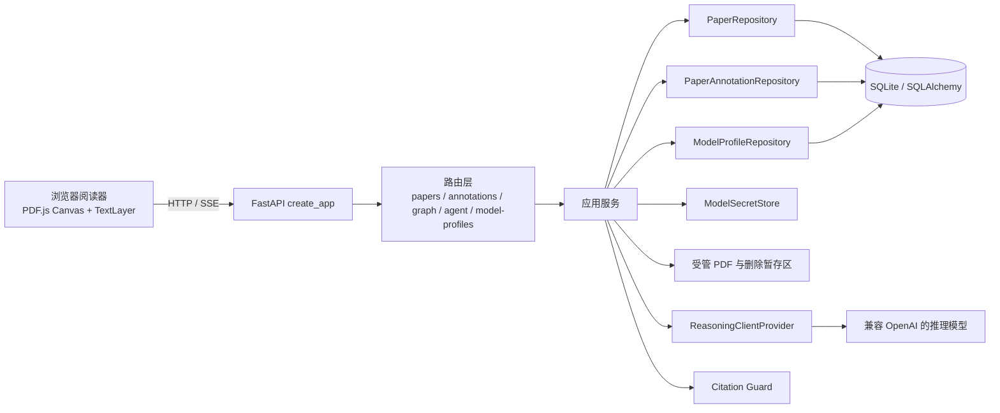
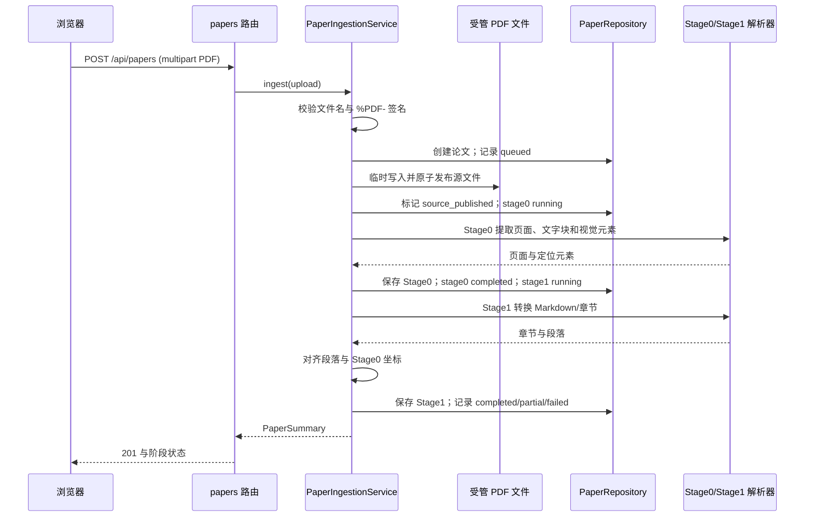
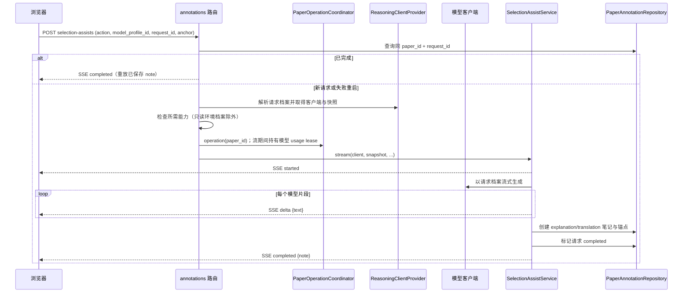
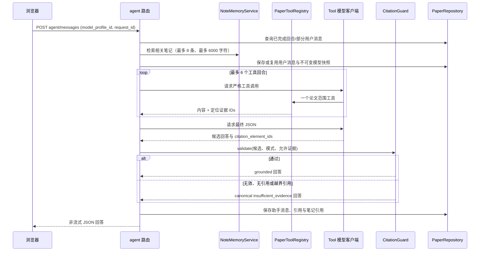
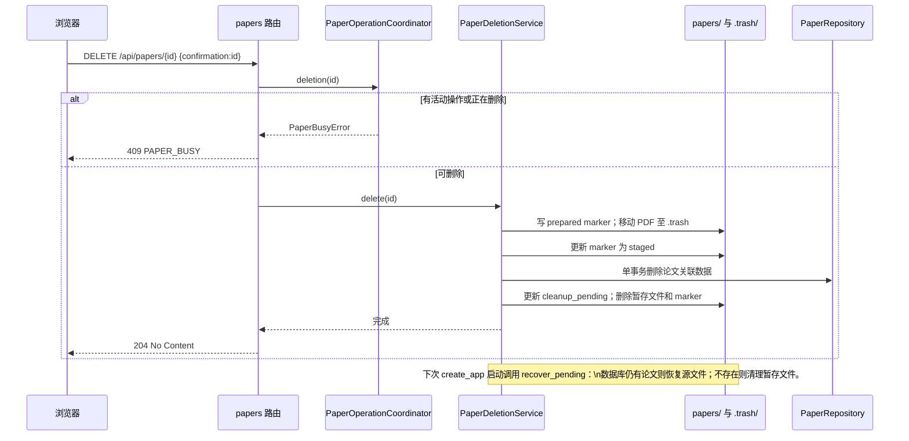

# 系统架构

本文说明当前代码的运行边界与数据流；接口的结构性字段以 [OpenAPI/接口说明](api.md) 为准，持久化关系以 [数据模型与删除恢复](data-model.md) 为准。本文不描述计划中的能力。

## 系统边界

浏览器中的 PDF.js `Canvas` 与 `TextLayer` 共享 viewport；选区只接受同页、可复制的文字层，矩形以页面归一化坐标保存。具体锚点契约见 [PDF 文本批注后端契约](pdf-annotations.md)。模型调用只经 `ReasoningClientProvider` 取得与本次请求绑定的客户端；API 密钥不进入数据库快照或响应。

## `app.state` 组成与职责

`create_app()` 在启动时组装以下对象。路由只从 `request.app.state` 取得其需要的协作者，不负责绕过服务层直接拼装模型客户端。

| `app.state` 对象 | 当前责任边界 |
| --- | --- |
| `settings` | 数据库 URL、数据目录、模型回退配置等运行参数。 |
| `model_profile_repository` | 模型档案的数据库 CRUD、修订号比较、默认档案切换与软删除。 |
| `model_secret_store` | 保存本地档案密钥并供后端按 `secret_ref` 读写；数据库只保存引用，API 只返回密钥存在状态与掩码。 |
| `reasoning_client_provider` | 解析启用的档案或只读环境回退，按 `(profile_id, revision)` 缓存 chat、structured、tool 三类客户端，并生成不含密钥的模型快照。 |
| `model_profile_service` | 档案输入约束、密钥与数据库变更的补偿、能力探测、`If-Match` 所需的并发语义，以及请求期间的 usage lease。 |
| `paper_repository` | 论文、解析阶段、页面/章节/元素、图谱、会话与消息的持久化和所有权校验；也保存图谱和 Agent 的请求重试记录。 |
| `annotation_repository` | 锚点、高亮、笔记和选区辅助请求的持久化、同论文范围的校验、批注请求幂等和选区辅助状态。 |
| `paper_operation_coordinator` | 单进程内论文操作与永久删除的互斥：普通写操作不能与删除并发。 |
| `paper_deletion_service` | 受管 PDF 的暂存、删除标记、调用仓储执行显式逆序事务清理和启动时恢复；不参与其他论文操作。 |
| `annotation_service` | 将 HTTP 锚点草稿转换为批注领域操作，执行高亮/手写笔记 CRUD，不承载模型调用。 |
| `selection_assist_service` | 对选区做解释或翻译的 SSE 编排；完成时创建 AI 笔记并保存可重放结果。 |
| `paper_tool_registry` | Agent 可用的严格工具定义与执行，限定在当前论文的元素、章节和图谱，并返回可引用的定位证据 ID。 |
| `citation_guard` | 校验 Agent 最终 JSON、模式限制和引用是否属于本次工具取得的定位证据；失败时规范化为证据不足答案。 |
| `paper_agent_runtime` | 有界 Agent 回合、同请求锁、会话/消息持久化、笔记检索注入、工具循环和 Citation Guard 前的最终回答编排。 |
| `paper_ingestion_service` | PDF 上传预检、受管源文件发布、Stage 0/1 解析、对齐、处理状态与文档读取。当前应用实际装配的子类还会补充 Stage 2/3 状态。 |
| `graph_construction_service` | 在已完成的解析内容上构建 core/deep 图谱、校验前置阶段、记录请求状态并替换相应图谱阶段。 |

`PaperRepository` 是论文主体与会话/图谱事实的唯一持久化边界；`PaperAnnotationRepository` 共享其数据库引擎，但只拥有批注、锚点、笔记和选区辅助记录；`ModelProfileRepository` 只拥有模型档案元数据。服务不得把密钥写进模型快照：快照只含 `profile_id`、显示名、`base_url`、模型名和修订号，故历史消息、笔记与处理记录在档案变更或删除后仍可追溯。

## 关键时序

### 上传与解析

上传是同步处理流程：Stage 0 失败返回论文摘要中的失败状态；Stage 1 失败可使论文为 `partial`。路由仅把无效 PDF 上传映射为 `422`，公开处理错误会被收敛，避免泄漏内部异常。

### 选区解释/翻译与自动建笔记

这是选区辅助专用的 SSE 管线，不是主 Agent 聊天管线。只有 `completed` 代表完整 AI 笔记已持久化；取消、失败或超长输出不会留下半成品笔记。

### Agent 笔记检索与 Citation Guard

主 Agent **在 Citation Guard 校验通过或被规范化为证据不足之前不会输出响应**，因此为非流式 JSON。笔记仅是标注为不可信的本地检索上下文，不能充当论文引用。`citation_element_ids` 必须来自本请求工具回合的、可定位论文元素；`paper_only` 模式也不允许 `background_explanation`。笔记排序、字符预算和引用回显见 [笔记记忆与 Agent 注入](note-memory.md)。

图中的 Agent 入口合并表示路由和运行时：路由解析请求模型并进入论文操作与模型使用租约，笔记检索、消息写入、工具执行和 Guard 编排实际由 `PaperAgentRuntime` 完成。模型返回工具调用描述，运行时调用 `PaperToolRegistry` 执行工具。

### 可崩溃恢复的永久删除

删除请求必须以论文 UUID 作为 `confirmation`。协调器先阻止新的普通操作；文件先从 `data_dir/papers/` 进入同一数据目录下的 `data_dir/.trash/` 并有持久 marker，数据库清理失败则尝试还原。提交后 marker 写入失败保留原有恢复标记与暂存 PDF，不再恢复源文件；启动恢复根据数据库事实继续清理。启动调用尚未处理损坏 marker 的恢复报告，具体限制见 [ADR 0003](adr/0003-crash-recoverable-paper-deletion.md)。稳定错误和数据库删除关系见 [数据模型与删除恢复](data-model.md)。

## 并发、请求身份与模型边界

- `request_id` 是论文内请求身份。Agent 使用它重放已完成回合；若已存在仅用户消息，重试必须保持内容、会话、模式、模型档案和模型快照一致，否则为冲突。图谱以 `stage + request_id` 识别：已完成重放，运行中冲突。高亮、带请求标识的手写笔记和选区辅助也各自保存幂等记录。
- 所有模型型请求显式接收 `model_profile_id`，而非在路由里悄悄改用默认档案。服务在调用期间持有 usage lease，正在被使用的可写档案不能删除。
- Agent、图谱和 AI 笔记保存请求时的不可变、无密钥模型快照；后续更新档案不会改写历史。
- `PaperOperationCoordinator` 只提供单进程互斥，不是分布式锁。永久删除与论文写操作冲突时返回 busy；调用方应在取得 `PAPER_BUSY` 后稍后以原删除确认重试。

## 关键决策

| ADR | 状态 | 摘要 |
| --- | --- | --- |
| [ADR 0001：请求作用域模型档案](adr/0001-request-scoped-model-profiles.md) | 已接受 | 每次模型请求显式解析并冻结无密钥档案快照，使同一会话可切换模型且历史来源保持可追溯。 |
| [ADR 0002：PDF 文本锚点](adr/0002-pdf-text-anchors.md) | 已接受 | PDF.js Canvas 与 TextLayer 共用 viewport，并以单页归一化矩形持久化可复制文字选区。 |
| [ADR 0003：可崩溃恢复的论文永久删除](adr/0003-crash-recoverable-paper-deletion.md) | 已接受 | 删除协调器通过 marker、源文件暂存、逆序数据库事务与启动恢复处理阶段间崩溃，并明确文件异常补偿的现有限制。 |
