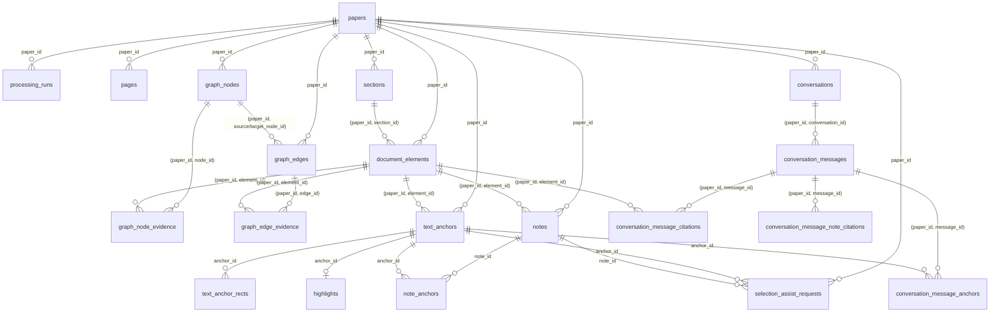
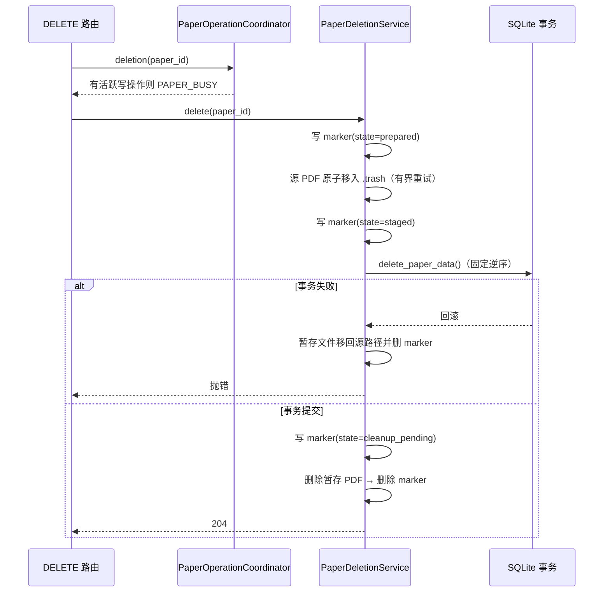

# 数据模型与删除恢复

本文是后端 SQLite schema、论文数据所有权和永久删除语义的事实来源。表结构以 `src/paper_agent/database.py` 为准，删除顺序以 `src/paper_agent/storage.py` 的 `PAPER_DELETE_ORDER` 为准，文件暂存与恢复以 `src/paper_agent/services/paper_deletion.py` 为准。数据库初始化会运行递增且幂等的迁移；实际命令见 [本地开发](development.md)，接口返回语义见 [HTTP API 业务语义](api.md)。

## ER 总览



`conversation_message_note_citations.note_id` **故意没有外键**：笔记删除后历史消息保留悬空引用，响应中标记 `available: false`（见[笔记记忆](note-memory.md)）。

## 表清单

所有论文拥有的表都带 `paper_id` 列，删除时按 `paper_id` 精确匹配，不使用跨论文子查询。复合外键携带 `paper_id`，保证被引用行属于同一论文。

### 论文解析

| 表 | 主键 | 外键 | 关键约束 |
|---|---|---|---|
| `papers` | `id` | — | 根表；`stored_filename` 只是 basename |
| `processing_runs` | `id` | `paper_id → papers.id` | `(paper_id, sequence)` 唯一 |
| `pages` | `id` | `paper_id → papers.id` | `(paper_id, number)` 唯一 |
| `sections` | `id` | `paper_id → papers.id` | `(paper_id, order_index)` 唯一 |
| `document_elements` | `id` | `paper_id → papers.id`；`(paper_id, section_id) → sections` | bbox 归一化与 `location_status` 一致性检查 |

### 知识图谱

| 表 | 主键 | 外键 | 关键约束 |
|---|---|---|---|
| `graph_nodes` | `id` | `paper_id → papers.id` | `(paper_id, node_type, normalized_name)` 唯一 |
| `graph_edges` | `id` | `paper_id → papers.id`；两端节点 → `graph_nodes` | — |
| `graph_node_evidence` | `(paper_id, node_id, element_id)` | 节点与元素复合外键 | 纯连接表 |
| `graph_edge_evidence` | `(paper_id, edge_id, element_id)` | 边与元素复合外键 | 纯连接表 |

### 批注与锚点

| 表 | 主键 | 外键 | 关键约束 |
|---|---|---|---|
| `text_anchors` | `id` | `paper_id → papers.id`；`(paper_id, element_id) → document_elements` | 同论文内按 `quote_hash` 复用 |
| `text_anchor_rects` | `(anchor_id, order_index)` | `anchor_id → text_anchors.id`；`paper_id → papers.id` | 矩形归一化检查 |
| `highlights` | `id` | `paper_id → papers.id`；`anchor_id → text_anchors.id` | `anchor_id` 唯一（一个锚点一个高亮）；`(paper_id, request_id)` 部分唯一索引 |

### 笔记

| 表 | 主键 | 外键 | 关键约束 |
|---|---|---|---|
| `notes` | `id` | `paper_id → papers.id`；`(paper_id, element_id) → document_elements` | `(paper_id, order_index)` 唯一；`(paper_id, request_id)` 部分唯一索引 |
| `note_anchors` | `(note_id, paper_id, anchor_id)` | 笔记、论文、锚点外键 | 纯连接表 |

### 选区辅助与会话

| 表 | 主键 | 外键 | 关键约束 |
|---|---|---|---|
| `selection_assist_requests` | `id` | `paper_id → papers.id`；`anchor_id`、`note_id` | `(paper_id, request_id)` 唯一（幂等） |
| `conversations` | `id` | `paper_id → papers.id` | — |
| `conversation_messages` | `id` | `(paper_id, conversation_id) → conversations` | `(conversation_id, sequence)` 唯一 |
| `conversation_message_citations` | `(paper_id, message_id, element_id)` | 消息与元素复合外键 | 带 `citation_snapshot_json` |
| `conversation_message_anchors` | `(paper_id, message_id, anchor_id)` | 消息复合外键；`anchor_id → text_anchors.id` | — |
| `conversation_message_note_citations` | `(paper_id, message_id, note_id)` | 消息复合外键 | `note_id` 无外键，允许悬空 |

### 模型档案（全局，不属于论文）

`model_profiles` 是全局表，软删除（`deleted_at`），**论文删除绝不触碰**。`processing_runs`、`notes`、`selection_assist_requests`、`conversation_messages` 上的 `model_profile_id` + `model_snapshot_json` 是请求作用域调用的追溯快照，不含密钥，档案删除后快照仍保留。模型档案的修订与 usage lease 见 [模型服务与模型档案](model-services.md)。

## 永久删除

删除由 `PaperOperationCoordinator`（进程内互斥）与 `PaperDeletionService`（文件暂存 + 单事务删除 + 恢复标记）协作完成，API 为 `DELETE /api/papers/{paper_id}`，请求体 `{"confirmation": "<paper-id>"}`，错误码固定为 `PAPER_NOT_FOUND`、`PAPER_BUSY`、`DELETE_CONFIRMATION_MISMATCH`、`DELETE_RECOVERY_REQUIRED`。

### 文件系统边界

- 只访问 `Settings.papers_dir`（`data_dir/papers`）与 `Settings.trash_dir`（`data_dir/.trash`）。
- `stored_filename` 必须是 basename；拒绝符号链接；resolve 后必须仍在 `papers_dir` 内。
- marker 只保存 basename，不保存绝对路径；写 marker 用临时文件原子替换。
- Windows 文件占用按 50ms、150ms、350ms 有界重试，超过上限返回 `PAPER_BUSY`，不强制删除。

### 删除时序



数据库删除在**一个事务**内完成，顺序固定（`PAPER_DELETE_ORDER`，子表先于父表）：

```text
conversation_message_note_citations → conversation_message_anchors
→ conversation_message_citations → conversation_messages → conversations
→ selection_assist_requests → note_anchors → notes → highlights
→ text_anchor_rects → text_anchors → graph_edge_evidence
→ graph_node_evidence → graph_edges → graph_nodes → document_elements
→ sections → pages → processing_runs → papers
```

### marker 状态机与启动恢复

marker 位于 `.trash/<paper-id>.delete.json`，状态只有三种：

| 状态 | 含义 | 崩溃后恢复动作 |
|---|---|---|
| `prepared` | 已写 marker，源文件尚未移动或移动中 | 论文行仍在 → 若 trash 文件存在则移回源路径，删 marker（`restored`） |
| `staged` | 源文件已入 trash，数据库事务未完成 | 同上（论文行仍在则恢复） |
| `cleanup_pending` | 数据库已提交，暂存文件未清 | 论文行已不存在 → 删 trash 文件和 marker（`cleaned`） |

`create_app()` 在注册路由前调用 `recover_pending()`：按论文行是否存在决定恢复源文件或完成清理；损坏或占用的 marker 记为 `damaged_markers` 保留供人工检查，不阻止其他论文恢复。恢复报告只含 paper ID，不含路径细节。

## 单项删除语义

- 删除高亮不删除文本锚点或引用该锚点的笔记（见 [PDF 文本批注后端契约](pdf-annotations.md)）。
- 删除笔记不删除高亮，也不自动删除锚点；历史消息引用保留 `note_id` 并标记 `available: false`（见[笔记记忆](note-memory.md)）。
